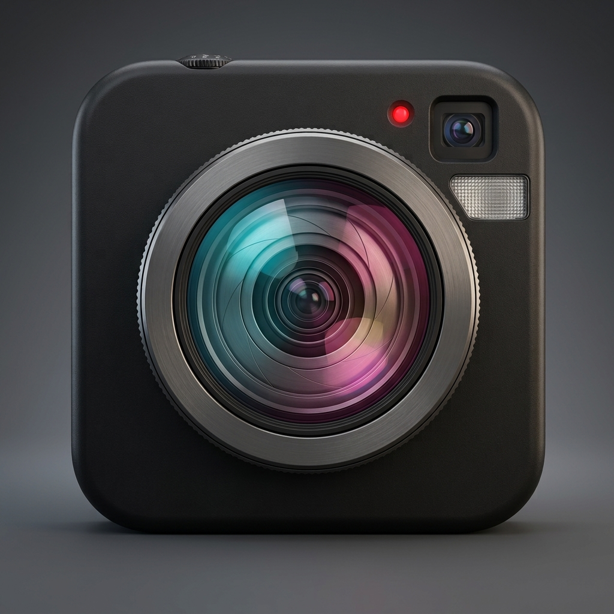

<p align="center">
  
</p>

<h1 align="center">NovaCamera(ON HOLD)</h1>

<p align="center">
  <b>A deliberate Android camera: full manual control, student scan flow, private vault.</b><br />
  CameraX + Camera2 · Jetpack Compose M3 · ML Kit (optional) · Android 7.0+
</p>

<p align="center">
  <a href="https://github.com/yubiiixtreme/nova-camera/actions/workflows/android.yml"></a>
  <a href="https://github.com/yubiiixtreme/nova-camera/releases"></a>
  
  
  <a href="LICENSE"></a>
</p>

---

| 📷 Shoot deliberately | 🎓 Scan & study | 🔒 Private by default |
|---|---|---|
| ISO / 1/8000s–30s shutter / 2000–10000K WB / EV / manual focus, AF/AE lock, true 3–7 frame AEB, burst, timelapse | Pick a photo of notes → straighten → copy/share OCR text → save & share PDF, with Mono/Warm/Cool looks + `.cube` import | Keystore-encrypted vault with biometric gate, EXIF stripping on export, location tagging OFF by default |

Plus: live histogram / zebra / focus meter from real frame data, thirds + golden-ratio + center grids, aspect masks, gyro level, volume-key shutter, clean-viewfinder mode, named presets — in a **~3MB** install. Details: [`docs/PRO_CONTROLS.md`](docs/PRO_CONTROLS.md).

## Get it

- **APK (GitHub Releases)** — per-ABI builds, pick yours (`arm64-v8a` fits almost all phones):
  [`nova-camera-vX.Y.Z-<abi>.apk`](https://github.com/yubiiixtreme/nova-camera/releases)
- **F-Droid** — a Google-free `foss` flavor is ready and waiting on review; submission guide: [`docs/FDROID.md`](docs/FDROID.md)
- **Build it yourself** — [`docs/BUILD_APK.md`](docs/BUILD_APK.md) (one SDK script, then `./gradlew`)

```bash
./scripts/setup-android-sdk.sh
./gradlew :app:assembleGmsDebug      # standard build (ML via Play Services)
./gradlew :app:assembleFossDebug     # Google-free build
./gradlew :app:testGmsDebugUnitTest :app:testFossDebugUnitTest
```

## Flavors

| | `gms` (standard) | `foss` (F-Droid) |
|---|---|---|
| OCR / barcode / face ML | ✅ via Play Services | ❌ excluded (camera, vault, scan-warp, PDF all work) |
| Google libraries | thin clients | none |
| Size (release/arm64) | ~3.3MB | even smaller |

## Project layout

```
nova-camera/
├── app/src/{main,gms,foss}/   # shared code + per-flavor ML implementations
├── docs/                       # BUILD_APK · PRO_CONTROLS · FDROID · ARCHITECTURE
├── fastlane/metadata/android/  # store-listing metadata
└── .github/workflows/android.yml
```

MVVM + MVI (`CameraUiState`), Clean Architecture, Hilt, Coroutines/Flow, MediaStore scoped storage. Kotlin 1.9.24 · AGP 8.5.2 · Java 17 · Target/Compile 34.

## Permissions & privacy

Camera, mic, media-read, optional location (default OFF). `stripExifOnExport` defaults ON. Vault files live in app-private storage, excluded from backup, AES256-GCM via Keystore + biometric gate.

## License

MIT — see [`LICENSE`](LICENSE).
